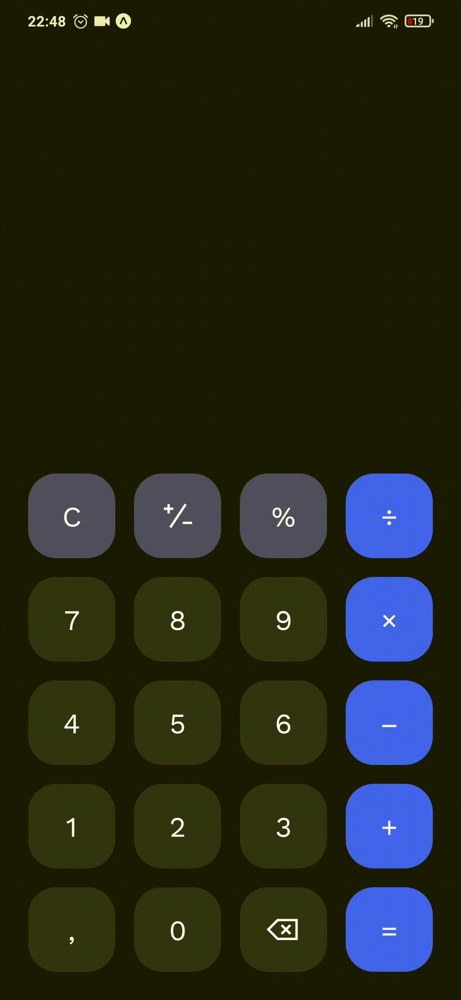

<p align="center">
   
   <a href="https://github.com/ermesonsampaio/calculator-app/stargazers">
    
  </a>
</p>

<h1 align="center">
  
</h1>

<h4 align="center"> 
	Uma calculadora simples construída com React Native 🚀
</h4>

<p align="center">
 <a href="#-sobre-o-projeto">Sobre</a> •
 <a href="#-como-executar-o-projeto">Como executar</a> •
 <a href="#user-content--licença">Licença</a>
</p>

## 💻 Sobre o projeto

Esse projeto foi desenvolvido para praticar as habilidades desenvolvidas durante meus estudos em `React Native`.

## 🚀 Como executar o projeto

```bash
git clone https://github.com/ermesonsampaio/calculator-app.git

cd calculator-app

npm install

npm run start
```

## 📝 Licença

Este projeto esta sobe a licença [MIT](./LICENSE).